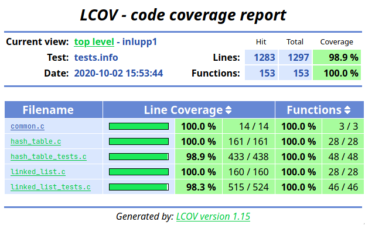

# Build and run
```bash
make tests # compile and run all tests
make hash_table_tests # compile and run hash table tests only
make linked_list_tests # compile and run linked list/iterator tests only

make memtest # run all tests through valgrind for memory management information
make hash_table_mem # run hash table tests only through valgrind
make linked_list_mem # run linked list/iterator tests only through valgrind

make clean # removes all generated and compiled files
```

# Test coverage
The current tests has a 100% function coverage and a 98.9% line coverage, though the only untested lines are the error handling for non-passing tests in CUnit.
In other words, the tests currently covers all lines and branches of our code. 

Coverage is done by `gcov` and the source files are compiled with the `-fprofile-arcs -ftest-coverage` flags. 
The coverage data is then parsed through `lcov` and passed to `genhtml` for a HTML representation of the data.

All this can be ran automatically using `make coverage`.




# Documentation
## Includes and setup
Documentation of the functions are included in the header files.
The code is separated into four header files, `common.h`, `hash_table.h`, `linked_list.h`, and `iterator.h`.
Both the hash table, and the linked list needs `common.h` to function properly.
If you only want to make use of the linked list, you will need to import all the header files except for hash table.
The iterator is a part of the linked list code, as it's an iterator over the linked list.
If you only want the hashtable, you only need `common.h` and `hash_table.h`, however the functions ioopm hash table keys and
ioopm hash table values returns a linked list, so you need to import `linked_list.h` aswell if you want to make use of these functions.

`common.h` also contains a few utility functions that you can use, e.g. a string hashing function, `elem_t` creation macros, as well as macros
for getting the success/failure state of a function.

## Generic data and memory management
The hash table supports generic types for both keys and values and in most cases it frees the memory for you. However, his is **not** the case, if you insert
pointers. If a pointer is inserted into the hash table, the user is responsible for deallocating it before the termination of the program.

## Error handling
Failures are handled througout the program with errno, an integer variable imported from `errno.h`. The user can check if a function returned an error by
using the `HAS_ERROR()` macro, defined in `common.h`. Note that `errno` only gets set by function-calls that has a failure state. 
A function that has a failure state **always** resets the value of `errno` on success.
If a function fails and `HAS_ERROR()` returns true, you should not read or use the return value of the function.

# Initial Profiling Results
## small.txt
Top 3 functions: 
1. `_dl_start (ld-2.32.so)`
2. `_dl_sysdep_start (ld-2.32.so)`
2. `dl_main (ld-2.32.so)`

Top 3 functions from our code:
1. `ioopm_hash_table_create (hash_table.c)`
2. `ioopm_hash_table_lookup (hash_table.c)`
2. `ioopm_hash_table_insert (hash_table.c)`

## 1k-long-word.txt
Top 3 functions: 
1. `process_file (freq_count.c)`
2. `string_hash (freq_count.c)`
3. `process_word (freq_count.c)`

Top 3 functions for our code:
1. `string_hash (freq_count.c)`
2. `ioopm_hash_table_lookup (hash_table.c)`
3. `ioopm_hash_table_insert (hash_table.c)`

## 10k-long-word.txt
Top 3 functions:
1. `process_file (freq_count.c)`
2. `find_previous_entry_for_key (hash_table.c)`
3. `process_word (freq_count.c)`

Top 3 functions for our code:
1. `find_previous_entry_for_key (hash_table.c)`
2. `ioopm_hash_table_lookup (hash_table.c)`
3. `ioopm_hash_table_insert (hash_table.c)`

## 16k-long-word.txt
Top 3 functions:
1. `find_previous_entry_for_key (hash_table.c)`
2. `process_file (freq_count.c)`
3. `eq_elem_string (common.c)`

Top 3 functions for our code:
1. `find_previous_entry_for_key (hash_table.c)`
2. `eq_elem_string (common.c)`
3. `ioopm_hash_table_lookup (hash_table.c)`

## english-words.txt
This file contains almost 500.000 unique words and trying to insert those into a hash table with 
a capacity of 17 means that each bucket will hold about ~30000 entries at completion (if evenly distributed). 

This proves to be too much to handle and generally, the program does not terminate gracefully. 


```bash
real time: 0.058s
user time: 0.050s
system time: 0.007s
memory allocations: 15.394 allocations & frees, 528.620 bytes allocated.
```

As you can see, the top 3 functions are quite consistent across different inputs (except for `small.txt` because of its extremely small size and fast execution time).
`find_previous_entry_for_key` is one of the top functions in inputs of a greater size, which is to be expected since most of the public functions will use
it internally.

### Is there some kind of trend?
As the list grows, finding the previous entry gets more and more expensive and this goes hand in hand with `eq_elem_string` function. 
When finding a previous entry, we must compare the key of each entry that is located before the entry that we are looking for.
Since the hash table stores the value, not the hash code, we must hash each key and compare it to the key that we are searching for.
`process_file` is the function that actually calls `ioopm_hash_table_insert` and `ioopm_hash_table_lookup`, so it is to be expected that it is one 
of the top 3 functions, considering the other top functions.

### Do the results correspond with your expectations?
Yes.

### Based on these results, do you see a way to make your program faster?
Increasing the amount of buckets within the hashtable would allocate more memory, but inserting/looking up would have a faster execution time.

# Optimized profiling results
The smaller files are quite uninteresting, so we will only compare the performance of larger files.

## 16k-long-word.txt
Top 3 functions:
1. `process_file (freq_count.c)`
2. `process_word (freq_count.c)`
3. `ioopm_hash_table_insert (hash_table.c)`

Top 3 functions for our code:
1. `ioopm_hash_table_insert (hash_table.c)`
2. `resize_hash_table (hash_table.c)`
3. `entry_create (hash_table.c)`


```bash
real time: 0.014s
user time: 0.03s
system time: 0.010s
memory allocations: 39.298 allocations & frees, 1.241.356 bytes allocated.
```


The timing results (even though they are very small) show a significant increase in performance, at almost 4x the speed.
This does come with about 2x the amount of allocations and memory usage. Depending on your use-cases, you can modify
the load factor and initial capacity to get better memory usage or better performance. Having both is not always possible.


As you can see, `find_previous_entry_for_key` is no longer present in the top 3 functions, which is to be expected,
since it is only used when searching through a bucket. Having more buckets with less entries means that it won't
have to search through as many entries as before to find the previous entry to a key.


However, we now have another function that is taking some time that was not present before. Namely, the `resize_hash_table`
function. In the case with the `16k-words.txt` file, the hash table resizes 9 times and each time, a new buckets array
is allocated, all entries are copied over to the new buckets array and the old entries are removed. 
This also explains why `entry_create` is now also a top 3 function.
It is used when copying over the entries and creating buckets.


## english-words.txt
Top 3 functions:
1. `process_file (freq_count.c)`
2. `process_word (freq_count.c)`
3. `ioopm_hash_table_insert (hash_table.c)`

Top 3 functions for our code:
1. `ioopm_hash_table_insert (hash_table.c)`
2. `resize_hash_table (hash_table.c)`
3. `entry_create (hash_table.c)`


Compared to earlier compilation without the dynamic buckets, it actually works now. That it had faults earlier wasn't all that surprising, as the buckets became overfilled with entries, making it hard to iterate through for the lookup function.
Both `process_word` and `ioopm_hash_table_insert` gets called upon the same amount of times, which is not that surprising, as it's only unique words that are being sorted.


Like the `16k-words.txt` file, `resize_hash_table` creeps up in the time usage, and the same with `entry_create`.
This is because the text file only consists of unique words, which means that every single word in the file will be an unique entry, leading to 14 resizes of the hash table.


```bash
real time: 1.571sec
user time: 1.078sec
sys time: 0.461sec
mem allocation: 4.810.581 allocations & frees, 175.569.247 bytes allocated.
```


As you can see, the memory usage and total allocations are quite high. This is partially because of the resizing that takes place. 
We can measure the performance impact of the resizing and rehashing by simply setting the load factor to `1.0` and the initial capacity
to `500000` in our `ioopm_hash_table_create_custom` constructor. Those options will make sure that it never resizes.
 
 
These are the results that we got:
```bash
real time: 1.242sec
user time: 0.712sec
sys time: 0.467sec
mem allocation: 2.246.776 allocations & frees, 96.802.924 bytes allocated.
```